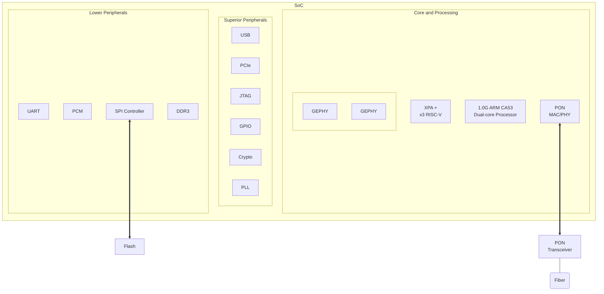

# Overview

EN7529CT is a highly integrated single-chip solution for xPON application. It integrates four
Ethernet GPHYs, one DDR3 controller, one USB3.0 host, one USB2.0 host, two PCle Gen2 ports,
and also a PCM controller with ISI/ZSI compatible interface for VolP application, so that fully
meets future smart home gateway requirements.

EN7529CT features a 1.0GHz ARM CA53 dual-core CPU and a powerful Xmart Packet Accelerator
(XPA), which can support unmatched network features with extremely high packet processing
capability. With XPA, EN7529CT performs an advanced QoS, security and flexible protocol
management. EN7529CT also integrate three proprietary RISC-V cores to accelerate WiFi and
security applications. By leading power-saving technology, EN7529CT makes system board
design simple and easy, so as to provide unique solution with low system cost and ultra-low
power consumption in the market.

# Features

- *Highly integrated WAN interfaces*
  - Compliant with ITU-T G.984/G.988 and IEEE802.3ah standards
  - One single chip solution designed for EPON/GPON application.
  - Support Active Ethernet
  - GPON support 32-TCONTs, 256 GEM port, with flexible GEM port to T-CONTS mapping mechanism, and status report/traffic monitor DBA mode
  - GPON support AES-128 decryption and encryption
  - EPON support 8 LLIDs, triple-churning decryption algorithm defined by CTC
  - Support PON rouge ONU detection, dying-gasp, Type-C optical protection switching
  - Providing MIB counters and sniffer function for quickly field debug purpose

- *Un-matched and Xmart packet processing engine*
  - Xmart packet accelerator can support wire-speed packet processing and forwarding capability without CPU's involvement
  - Support up to 32K flows, including L2 bridge, IPv4 NAT/Routing, IPv4 NAPT, IPv6 3/5-tuple routing, 6RD and DS-LITE, NPTv6, VxLAN, NVGRE
  - Powerful traffic classification engine parsing L2 to L4 header information
  - Flexible VLAN translation functions defined in TR-156 and CTC Spec.
  - Support L2 and L3 multicast streams and multicast VLAN translation
  - Configurable packet buffer location with efficient page-based link-list buffer management
  - Effective QoS scheme including per-flow TrTCM traffic shaping, SP/WRR/SP+WRR for traffic scheduling, tail-drop and RED for congestion handling
  - Support up to 16K jumbo frame

- *Highly integrated LAN interfaces*
  - x4 GEPHY
  - x3 HSGMII combo with PCIE/USB SerDes.

- *Powerful SoC platform*
  - 1.0GHz ARM CA53 dual-core CPU, 256K L2 cache
  - Integrate three proprietary RISC-V cores for WiFi and security acceleration
  - Support up to 1GB DDR3-1866 SDRAM
  - Support SPI NOR/NAND flash
  - Two PCle Gen2 interfaces for dual-band WiFi application
  - One USB3.0 interface and one USB 2.0 interface
  - Provide one PCM or two ZSI/ISI interfaces
  - Built-in crypto engine for security application
  - Two UARTS
  - One 12C master and one 12C slave

# Block Diagram



## SerDes Configuration

| SerDes Name      | Mode                |
| :--------------- | :------------------ |
| PON SerDes       | PON/HSGMII/5GBASE-R |
| PCle Gen2 SerDes | PCle Gen2/HSGMII    |
| USB3 SerDes      | USB3/HSGMII         |


# Balls

|       | *Pin Types*    |
| :---: | :------------- |
|   I   | Input          |
|   O   | Output         |
|  IO   | Bi-directional |
|   P   | Power          |
|   G   | Ground         |
|   A   | Analog pin     |


| Pin                                   |     Name      | Type  | Description                                                                                   |
| ------------------------------------- | :-----------: | :---: | :-------------------------------------------------------------------------------------------- |
| **Crystal**                           |
| AA8                                   |    XTAL_IN    |   I   | Crystal input                                                                                 |
| AB8                                   |   XTAL_OUT    |   O   | Crystal output                                                                                |
| W14                                   |  AVDD33_XTAL  |   P   | Crystal 3.3V power                                                                            |
| **SPI Interface**                     |
| AB14                                  |    SPI_CS0    |  IO   | SPI Device chip selection                                                                     |
| AC14                                  |    SPI_CLK    |  IO   | SPI Clock output                                                                              |
| AB12                                  |   SPI_MISO    |  IO   | SPI Data. Connected to SPI flash device D0 (IO1) pin. for dual-mode SPI, this pin is SPI_DIO1 |
| AA12                                  |   SPI_MOSI    |  IO   | SPI Data. connected to SPI DLASH device D1 (IO0) pin. for dual-mode SPI, this pin is SPI_DIO0 |
| **UART Interface**                    |
| V2                                    |   UART_TXD    |   O   | UART Transmit data output                                                                     |
| V3                                    |   UART_RXD    |   I   | UART Receive data input                                                                       |
| **I2C Interface**                     |
| AA13                                  |    I2C_SCL    |  IO   | I2C Clock                                                                                     |
| AB13                                  |    I2C_SDA    |  IO   | I2C Data                                                                                      |
| **SLIC Interface**                    |
| D2                                    |     ZMOSI     |  IO   | ZSI Data                                                                                      |
| E3                                    |     ZCLK      |  ΙO   | ZSI Clock                                                                                     |
| G3                                    |     ZSYNC     |  IO   | ZSI Sync                                                                                      |
| D1                                    |     ZMISO     |  IO   | ZSI Data                                                                                      |
| **USB Port 0 Interface**              |
| AA16                                  |  AVDD33_USB   |   P   | USB analog 3.3V power                                                                         |
| AA10                                  |    USB_DPO    |   A   | USB2.0 port 0 bus D+ signal                                                                   |
| AB10                                  |    USB_DMО    |   A   | USB2.0 port 0 bus D- signal                                                                   |
| **USB Port 1 Interface**              |
| AA17, AA19, AB19                      |  AVSSK_SSUSB  |   G   | USB port 1 analog ground                                                                      |
| AC19                                  |  AVDDK_SSUSB  |   P   | USB port 1 analog core power                                                                  |
| AB16                                  | AVDD33_SSUSB  |   P   | USB port 1 analog 3.3V power                                                                  |
| AB11                                  |    USB_DP1    |   A   | USB2.0 port 1 bus D+ signal                                                                   |
| AC11                                  |    USB_DM1    |   A   | USB2.0 port 1 bus D- signal                                                                   |
| AB18                                  |   SSUSB_RXP   |   A   | USB3.0 port 1 RX differential signal positive                                                 |
| AA18                                  |   SSUSB_RXN   |   A   | USB3.0 port 1 RX differential signal negative                                                 |
| AB17                                  |   SSUSB_TXP   |   A   | USB3.0 port 1 TX differential signal positive                                                 |
| AC17                                  |   SSUSB_TXN   |   A   | USB3.0 port 1 TX differential signal negative                                                 |
| **PCIe Port 0 Interface**             |
| M2, M3, N3, R3, T1, T2                |  AVSSK_PCIE0  |   G   | PCIE port 0 analog ground                                                                     |
| T3                                    |  AVDDK_PCIE0  |   P   | PCIE port 0 analog core power                                                                 |
| G2                                    | AVDD33_PCIE0  |   P   | PCIE port 0 analog 3.3V power                                                                 |
| N2                                    |   PCIE_TXP0   |   A   | PCIE port 0 TX differential output positive                                                   |
| N1                                    |   PCIE_TXN0   |   A   | PCIE port 0 TX differential output negative                                                   |
| P3                                    |   PCIE_RXP0   |   A   | PCIE port 0 RX differential input positive                                                    |
| P2                                    |   PCIE_RXN0   |   A   | PCIE port 0 RX differential input negative                                                    |
| R2                                    |   PCIE_CKP0   |   A   | PCIE port 0 differential clock output positive                                                |
| R1                                    |   PCIE_CKN0   |   A   | PCIE port 0 differential clock output negative                                                |
| U3                                    |  PCIE_RESET0  |   Ο   | PCIE port 0 reset output                                                                      |
| **PCIe Port 1 Interface**             |
| H1, H2, J3, L3                        |  AVSSK_PCIE1  |   G   | PCIE port 1 analog ground                                                                     |
| T4                                    |  AVDDK_PCIE1  |   P   | PCIE port 1 analog core power                                                                 |
| G1                                    | AVDD33_PCIE1  |   P   | PCIE port 1 analog 3.3V power                                                                 |
| J1                                    |   PCIE_TXP1   |   A   | PCIE port 1 TX differential output positive                                                   |
| J2                                    |   PCIE_TXN1   |   A   | PCIE port 1 TX differential output negative                                                   |
| K2                                    |  PCIE_RXPР1   |   A   | PCIE port 1 RX differential input positive                                                    |
| K3                                    |   PCIE_RXN1   |   A   | PCIE port 1 RX differential input negative                                                    |
| L2                                    |   PCIE_CKP1   |   A   | PCIE port 1 differential clock output positive                                                |
| L1                                    |   PCIE_CKN1   |   A   | PCIE port 1 differential clock output negative                                                |
| U4                                    |  PCIE_RESET1  |   0   | PCIE port 1 reset output                                                                      |
| **xPON Interface**                    |
| E17                                   |  AVDD33_PON   |   P   | XPON analog 3.3V power                                                                        |
| C23                                   |   AVDDK_PON   |   P   | XPON analog core power                                                                        |
| A20, C20, C21, C22                    |   AVSSK_PON   |   P   | XPON analog core ground                                                                       |
| B22                                   |    PON_TXP    |   A   | PON analog transmit differential signal positive                                              |
| B23                                   |    PON_TXN    |   A   | PON analog transmit differential signal negative                                              |
| A21                                   |    PON_RXP    |   A   | PON analog receive differential signal positive                                               |
| B21                                   |    PON_RXN    |   A   | PON analog receive differential signal negative                                               |
| AA15                                  |  PON_RX_DIS   |  IO   | Disable PON receive signal                                                                    |
| AA14                                  | PON_TX_FAULT  |  IO   | PON transmit fault                                                                            |
| D19                                   | PON_BURST_EN  |  IO   | Burst enable (single-end)                                                                     |
| C19                                   |   PON_RX_SD   |  IO   | Detected PON received signal                                                                  |
| AC15                                  |  PON_TX_DIS   |  IO   | Disable PON transmit                                                                          |
| AB15                                  |   PON_TX_SD   |  IO   | Detected PON transmit signal                                                                  |
| **Giga-Ethernet Interface**           |
| B17                                   |   TXVP_A_PO   |   A   | GE Port 0 pair A differential signal positive                                                 |
| C17                                   |   TXVN_A_PO   |   A   | GE Port 0 pair A differential signal negative                                                 |
| B16                                   |   TXVP_B_PО   |   A   | GE Port 0 pair B differential signal positive                                                 |
| C16                                   |   TXVN_B_PO   |   A   | GE Port 0 pair B differential signal negative                                                 |
| B15                                   |   TXVP_C_PО   |   A   | GE Port 0 pair C differential signal positive                                                 |
| C15                                   |   TXVN_C_PO   |   A   | GE Port 0 pair C differential signal negative                                                 |
| B14                                   |   TXVP_D_PO   |   A   | GE Port 0 pair D differential signal positive                                                 |
| C14                                   |   TXVN_D_PO   |   A   | GE Port 0 pair D differential signal negative                                                 |
| B13                                   |   TXVP_A_P1   |   A   | GE Port 1 pair A differential signal positive                                                 |
| C13                                   |   TXVN_A_P1   |   A   | GE Port 1 pair A differential signal negative                                                 |
| B12                                   |   TXVP_B_P1   |   A   | GE Port 1 pair B differential signal positive                                                 |
| C12                                   |   TXVN_B_P1   |   A   | GE Port 1 pair B differential signal negative                                                 |
| B11                                   |   TXVP_C_P1   |   A   | GE Port 1 pair C differential signal positive                                                 |
| C11                                   |   TXVN_C_P1   |   A   | GE Port 1 pair C differential signal negative                                                 |
| B10                                   |   TXVP_D_P1   |   A   | GE Port 1 pair D differential signal positive                                                 |
| C10                                   |   TXVN_D_P1   |   A   | GE Port 1 pair D differential signal negative                                                 |
| B9                                    |   TXVP_A_P2   |   A   | GE Port 2 pair A differential signal positive                                                 |
| C9                                    |   TXVN_A_P2   |   A   | GE Port 2 pair A differential signal negative                                                 |
| B8                                    |   TXVP_B_P2   |   A   | GE Port 2 pair B differential signal positive                                                 |
| C8                                    |   TXVN_B_P2   |   A   | GE Port 2 pair B differential signal negative                                                 |
| B7                                    |   TXVP_C_P2   |   A   | GE Port 2 pair C differential signal positive                                                 |
| C7                                    |   TXVN_C_P2   |   A   | GE Port 2 pair C differential signal negative                                                 |
| B6                                    |   TXVP_D_P2   |   A   | GE Port 2 pair D differential signal positive                                                 |
| C6                                    |   TXVN_D_P2   |   A   | GE Port 2 pair D differential signal negative                                                 |
| B5                                    |   TXVP_A_P3   |   A   | GE Port 3 pair A differential signal positive                                                 |
| C5                                    |   TXVN_A_P3   |   A   | GE Port 3 pair A differential signal negative                                                 |
| B4                                    |   TXVP_BРЗ    |   A   | GE Port 3 pair B differential signal positive                                                 |
| C4                                    |   TXVN_B_P3   |   A   | GE Port 3 pair B differential signal negative                                                 |
| B3                                    |   TXVP_C_P3   |   A   | GE Port 3 pair C differential signal positive                                                 |
| C3                                    |   TXVN_C_P3   |   A   | GE Port 3 pair C differential signal negative                                                 |
| B2                                    |   TXVP_D_P3   |   A   | GE Port 3 pair D differential signal positive                                                 |
| B1                                    |   TXVN_D_P3   |   A   | GE Port 3 pair D differential signal negative                                                 |
| C1                                    |   GBE_REXT    |   A   | GE PHY external resistance                                                                    |
| F7, F8, F9, F10                       |   AVDDK_GBE   |   P   | GE PHY Analog core power                                                                      |
| E5, E8, E9, E12, E13                  |  AVDD33_GBE   |   P   | GE PHY Analog 3.3V power                                                                      |
| **DDR(both KGD and non-KGD package)** |
| E20                                   |    NC_E20     |   A   | DRAM KGD output driving calibration, not connected for non-KGD package                        |
| E19                                   |    NC_E19     |   A   | DRAM KGD reference voltage, not connected for non-KGD package                                 |
| V17                                   |    DDR_RTN    |   A   | DDR I/O driving calibration                                                                   |
| H17, J17                              |   VCCK_DDR    |   P   | DDR core power                                                                                |
| T17                                   |  AVDD33_RDDR  |   P   | DDR analog core power                                                                         |
| N17                                   | AVDD15_DDR_CK |   P   | DDR analog 1.5V power                                                                         |
| K17, L17, M17                         | AVDD15_DDR_DQ |   P   | DDR analog 1.5V power                                                                         |
| P17, R17                              | AVDD15_DDR_CA |   P   | DDR analog 1.5V power                                                                         |
| **DDR (non-KGD package only)**        |
| W16                                   |    VREFDQ     |   A   | DDR DQ reference voltage                                                                      |
| W15                                   |    VREFCA     |   A   | DDR CA reference voltage                                                                      |
| V18                                   |    DDR_RTР    |   A   | Reserved                                                                                      |
| W21                                   |  DDR_RESETB   |   O   | DDR reset                                                                                     |
| P21                                   |     RODT      |   O   | DDR I/O On Die Termination                                                                    |
| G19                                   |     DQS0      |  IO   | DRAM data strobe for DQ0~7 Differential positive                                              |
| G20                                   |     DQSB0     |  IO   | DRAM data strobe for DQ0~7 Differential negative                                              |
| J19                                   |     DQS1      |  IO   | DRAM data strobe for DQ8~15 Differential positive                                             |
| J20                                   |     DQSB1     |  IO   | DRAM data strobe for DQ8~15 Differential negative                                             |
| H21                                   |     DQM0      |   O   | DRAM data mask for write command, DQM0: for DQ0~7                                             |
| J22                                   |     DQM1      |   Ο   | DRAM data mask for write command, DQM1 for DQ8~15                                             |
| L19                                   |      CLK      |   Ο   | DDR differential clock positive                                                               |
| L20                                   |     CLKB      |   O   | DDR differential clock negative                                                               |
| M22                                   |      DQ0      |  IO   | DRAM data bus bit 0                                                                           |
| E22                                   |      DQ1      |  IO   | DRAM data bus bit 1                                                                           |
| M21                                   |      DQ2      |  IO   | DRAM data bus bit 2                                                                           |
| E21                                   |      DQ3      |  IO   | DRAM data bus bit 3                                                                           |
| P23                                   |      DQ4      |  IO   | DRAM data bus bit 4                                                                           |
| D22                                   |      DQ5      |  IO   | DRAM data bus bit 5                                                                           |
| N21                                   |      DQ6      |  IO   | DRAM data bus bit 6                                                                           |
| D23                                   |      DQ7      |  IO   | DRAM data bus bit 7                                                                           |
| G21                                   |      DQ8      |  IO   | DRAM data bus bit 8                                                                           |
| L22                                   |      DQ9      |  IO   | DRAM data bus bit 9                                                                           |
| F22                                   |     DQ10      |  IO   | DRAM data bus bit 10                                                                          |
| L21                                   |     DQ11      |  IO   | DRAM data bus bit 11                                                                          |
| H23                                   |     DQ12      |  IO   | DRAM data bus bit 12                                                                          |
| K22                                   |     DQ13      |  IO   | DRAM data bus bit 13                                                                          |
| F21                                   |     DQ14      |  IO   | DRAM data bus bit 14                                                                          |
| K23                                   |     DQ15      |  IO   | DRAM data bus bit 15                                                                          |
| V21                                   |      RA0      |   O   | DRAM address bus bit 0                                                                        |
| V19                                   |      RA1      |   Ο   | DRAM address bus bit 1                                                                        |
| V22                                   |      RA2      |   Ο   | DRAM address bus bit 2                                                                        |
| T22                                   |      RA3      |   Ο   | DRAM address bus bit 3                                                                        |
| AB21                                  |      RA4      |   Ο   | DRAM address bus bit 4                                                                        |
| U22                                   |      RA5      |   O   | DRAM address bus bit 5                                                                        |
| AB22                                  |      RA6      |   O   | DRAM address bus bit 6                                                                        |
| U21                                   |      RA7      |   O   | DRAM address bus bit 7                                                                        |
| AB23                                  |      RA8      |   Ο   | DRAM address bus bit 8                                                                        |
| Y23                                   |      RA9      |   Ο   | DRAM address bus bit 9                                                                        |
| AA20                                  |     RA10      |   Ο   | DRAM address bus bit 10                                                                       |
| U19                                   |     RA11      |   Ο   | DRAM address bus bit 11                                                                       |
| AB20                                  |     RA12      |   O   | DRAM address bus bit 12                                                                       |
| Y21                                   |     RA13      |   O   | DRAM address bus bit 13                                                                       |
| V20                                   |     RA14      |   Ο   | DRAM address bus bit 14                                                                       |
| U20                                   |     RA15      |   O   | DRAM address bus bit 15                                                                       |
| N19                                   |      RCS      |   O   | DRAM chip selection                                                                           |
| P19                                   |     RRAS      |   O   | DRAM row address strobe                                                                       |
| P20                                   |     RCAS      |   O   | DRAM column address strobe                                                                    |
| AA22                                  |      RWE      |   O   | DRAM write enable                                                                             |
| R22                                   |     RBAO      |   O   | DRAM bank address bus bit 0                                                                   |
| AC21                                  |     RBA1      |   Ο   | DRAM bank address bus bit 1                                                                   |
| T23                                   |     RBA2      |   O   | DRAM bank address bus bit 2                                                                   |
| N20                                   |     RCKE      |   O   | Clock enable                                                                                  |
| **BGPOR**                             |
| W8, W9, W10, W11                      | AVDD33_BGPOR  |   P   | BGPOR analog 3.3V power                                                                       |
| AA7, AA9, AB9, AC9                    | AVSS33_BGPOR  |   G   | BGPOR analog 3.3V ground                                                                      |
| AC7                                   |   BGPOR_TN    |  IO   | Band gap pin for strap                                                                        |
| AB7                                   |   BGPOR_TP    |  IO   | Band gap pin for strap                                                                        |
| AA6                                   |  BGPOR_DGINP  |   I   | Dying gasp                                                                                    |
| **GPIO**                              |
| *                                     |     GPIO*     |  IO   | General IO                                                                                    |
| **Efuse**                             |
| C18                                   |     EFUSE     |   A   | Efuse Pin                                                                                     |
| **Misc.**                             |
| V1                                    |    HW_RSTN    |   I   | Chip reset, active low                                                                        |
| AB6                                   |    AVSMON     |   A   | AVS Pin                                                                                       |
| A18                                   |    REF_CKO    |   Ο   | Clock output, refer to 4.4 boot strap pin                                                     |
| E16                                   |  AVDD33_СКО   |   P   | Analog power for clock output                                                                 |
| **Power and Ground**                  |
| *                                     |     VCCK      |   P   | Core Power                                                                                    |
| G5, G6, G15, G16, V16                 |    DVDD33     |   P   | Digital IO 3.3V Power                                                                         |
| *                                     |      GND      |   G   | Ground                                                                                        |

```ascii
      01    02    03    04    05    06    07    08    09    10    11    12    13    14    15    16    17    18    19    20    21    22    23
   +-----+-----+-----+-----+-----+-----+-----+-----+-----+-----+-----+-----+-----+-----+-----+-----+-----+-----+-----+-----+-----+-----+-----+
A  | A01 | A02 | A03 | A04 | A05 | A06 | A07 | A08 | A09 | A10 | A11 | A12 | A13 | A14 | A15 | A16 |     |     | A19 | A20 | A21 | A22 | A23 |
   +-----+-----+-----+-----+-----+-----+-----+-----+-----+-----+-----+-----+-----+-----+-----+-----+-----+-----+-----+-----+-----+-----+-----+
B  | B01 | B02 | B03 | B04 | B05 | B06 | B07 | B08 | B09 | B10 | B11 | B12 | B13 | B14 | B15 | B16 | B17 | B18 |     | B20 | B21 | B22 | B23 |
   +-----+-----+-----+-----+-----+-----+-----+-----+-----+-----+-----+-----+-----+-----+-----+-----+-----+-----+-----+-----+-----+-----+-----+
C  |     | C02 | C03 | C04 | C05 | C06 | C07 | C08 | C09 | C10 | C11 | C12 | C13 | C14 | C15 | C16 | C17 | C18 |     | C20 | C21 | C22 | C23 |
   +-----+-----+-----+-----+-----+-----+-----+-----+-----+-----+-----+-----+-----+-----+-----+-----+-----+-----+-----+-----+-----+-----+-----+
D  |     |     | D03 | D04 | D05 | D06 | D07 | D08 | D09 | D10 | D11 | D12 | D13 | D14 | D15 | D16 | D17 |     |     | D20 | D21 | D22 | D23 |
   +-----+-----+-----+-----+-----+-----+-----+-----+-----+-----+-----+-----+-----+-----+-----+-----+-----+-----+-----+-----+-----+-----+-----+
E  |     |     |     |     | E05 |     | E07 | E08 |     | E10 | E11 |     |     |     | E15 | E16 |     |     | E19 | E20 | E21 | E22 |     |
   +-----+-----+-----+-----+-----+-----+-----+-----+-----+-----+-----+-----+-----+-----+-----+-----+-----+-----+-----+-----+-----+-----+-----+
F  |     |     |     |     |     | F06 | F07 | F08 | F09 |     |     |     |     |     |     |     |     |     |     | F20 | F21 | F22 |     |
   +-----+-----+-----+-----+-----+-----+-----+-----+-----+-----+-----+-----+-----+-----+-----+-----+-----+-----+-----+-----+-----+-----+-----+
G  | G01 | G02 |     | G04 | G05 |     |     |     |     |     |     |     | G13 | G14 |     |     |     | G18 | G19 | G20 | G21 | G22 |     |
   +-----+-----+-----+-----+-----+-----+-----+-----+-----+-----+-----+-----+-----+-----+-----+-----+-----+-----+-----+-----+-----+-----+-----+
H  | H01 | H02 |     |     |     |     | H07 | H08 | H09 | H10 | H11 | H12 | H13 | H14 | H15 | H16 | H17 |     |     | H20 | H21 | H22 | H23 |
   +-----+-----+-----+-----+-----+-----+-----+-----+-----+-----+-----+-----+-----+-----+-----+-----+-----+-----+-----+-----+-----+-----+-----+
J  | J01 | J02 | J03 |     | J05 |     | J07 | J08 | J09 | J10 | J11 | J12 | J13 | J14 | J15 | J16 | J17 |     | J19 | J20 | J21 | J22 |     |
   +-----+-----+-----+-----+-----+-----+-----+-----+-----+-----+-----+-----+-----+-----+-----+-----+-----+-----+-----+-----+-----+-----+-----+
K  |     | K02 | K03 |     | K05 |     | K07 | K08 | K09 | K10 | K11 | K12 | K13 | K14 | K15 | K16 | K17 |     |     | K20 | K21 | K22 |     |
   +-----+-----+-----+-----+-----+-----+-----+-----+-----+-----+-----+-----+-----+-----+-----+-----+-----+-----+-----+-----+-----+-----+-----+
L  | L01 | L02 | L03 |     | L05 |     | L07 | L08 | L09 | L10 | L11 | L12 | L13 | L14 | L15 | L16 | L17 |     | L19 | L20 | L21 | L22 |     |
   +-----+-----+-----+-----+-----+-----+-----+-----+-----+-----+-----+-----+-----+-----+-----+-----+-----+-----+-----+-----+-----+-----+-----+
M  |     | M02 | M03 |     | M05 |     | M07 | M08 | M09 | M10 | M11 | M12 | M13 | M14 | M15 | M16 | M17 |     |     |     | M21 | M22 | M23 |
   +-----+-----+-----+-----+-----+-----+-----+-----+-----+-----+-----+-----+-----+-----+-----+-----+-----+-----+-----+-----+-----+-----+-----+
N  | N01 | N02 | N03 |     | N05 |     | N07 | N08 | N09 | N10 | N11 | N12 | N13 | N14 | N15 | N16 | N17 |     | N19 | N20 | N21 | N22 |     |
   +-----+-----+-----+-----+-----+-----+-----+-----+-----+-----+-----+-----+-----+-----+-----+-----+-----+-----+-----+-----+-----+-----+-----+
P  |     | P02 | P03 |     | P05 |     | P07 | P08 | P09 | P10 | P11 | P12 | P13 | P14 | P15 | P16 | P17 |     | P19 | P20 | P21 | P22 | P23 |
   +-----+-----+-----+-----+-----+-----+-----+-----+-----+-----+-----+-----+-----+-----+-----+-----+-----+-----+-----+-----+-----+-----+-----+
R  | R01 | R02 | R03 |     | R05 |     | R07 | R08 | R09 | R10 | R11 | R12 | R13 | R14 | R15 | R16 | R17 |     |     | R20 | R21 |     |     |
   +-----+-----+-----+-----+-----+-----+-----+-----+-----+-----+-----+-----+-----+-----+-----+-----+-----+-----+-----+-----+-----+-----+-----+
T  | T01 | T02 |     | T04 | T05 |     | T07 | T08 | T09 |     |     |     |     |     |     | T16 | T17 |     |     | T20 |     | T22 |     |
   +-----+-----+-----+-----+-----+-----+-----+-----+-----+-----+-----+-----+-----+-----+-----+-----+-----+-----+-----+-----+-----+-----+-----+
U  |     |     | U03 | U04 | U05 | U06 | U07 | U08 | U09 | U10 | U11 | U12 | U13 |     |     |     |     | U18 | U19 | U20 | U21 | U22 |     |
   +-----+-----+-----+-----+-----+-----+-----+-----+-----+-----+-----+-----+-----+-----+-----+-----+-----+-----+-----+-----+-----+-----+-----+
V  | V01 | V02 | V03 | V04 | V05 | V06 |     |     |     |     |     |     |     | V14 | V15 | V16 |     | V18 | V19 | V20 | V21 | V22 | V23 |
   +-----+-----+-----+-----+-----+-----+-----+-----+-----+-----+-----+-----+-----+-----+-----+-----+-----+-----+-----+-----+-----+-----+-----+
W  |     |     |     | W04 | W05 | W06 |     | W08 | W09 | W10 | W11 |     |     | W14 | W15 | W16 |     |     |     |     | W21 | W22 |     |
   +-----+-----+-----+-----+-----+-----+-----+-----+-----+-----+-----+-----+-----+-----+-----+-----+-----+-----+-----+-----+-----+-----+-----+
Y  |     |     | Y03 | Y04 | Y05 | Y06 |     |     |     |     |     |     |     | Y14 | Y15 |     |     |     | Y19 | Y20 | Y21 | Y22 |     |
   +-----+-----+-----+-----+-----+-----+-----+-----+-----+-----+-----+-----+-----+-----+-----+-----+-----+-----+-----+-----+-----+-----+-----+
AA | AA1 | AA2 | AA3 |     | AA5 |     | AA7 | AA8 | AA9 | AA10| AA11|     |     | AA14| AA15| AA16| AA17|     | AA19| AA20| AA21| AA22|     |
   +-----+-----+-----+-----+-----+-----+-----+-----+-----+-----+-----+-----+-----+-----+-----+-----+-----+-----+-----+-----+-----+-----+-----+
AB | AB1 | AB2 |     | AB4 | AB5 | AB6 | AB7 | AB8 | AB9 | AB10| AB11|     |     | AB14| AB15| AB16| AB17|     | AB19| AB20| AB21| AB22|     |
   +-----+-----+-----+-----+-----+-----+-----+-----+-----+-----+-----+-----+-----+-----+-----+-----+-----+-----+-----+-----+-----+-----+-----+
AC | AC1 |     | AC3 | AC4 | AC5 |     | AC7 |     | AC9 | AC10|     |     |     |     | AC15| AC16| AC17|     | AC19| AC20| AC21| AC22| AC23|
   +-----+-----+-----+-----+-----+-----+-----+-----+-----+-----+-----+-----+-----+-----+-----+-----+-----+-----+-----+-----+-----+-----+-----+
```

## Pin Sharing Schemes

### JTAG Sharing Scheme

| Pin Name | GPIO Mode | Description               |
| :------- | :-------: | :------------------------ |
| GPIO24   |  GPIO24   | JTMS_I: JTAG TMS input    |
| GPIO26   |  GPIO26   | JTRST_I: JTAG reset input |
| GPIO22   |  GPIO22   | JTCLK_I: JTAG clock input |
| GPIO23   |  GPIO23   | JTDI_I: JTAG TDI input    |
| GPIO25   |  GPIO25   | JTDO_O: JTAG TDO output   |


### SLIC ZSI/ISI Sharing Scheme

-  **SLIC ZSI**

| Pin Name | GPIO Mode | Description                               |
| :------- | :-------: | :---------------------------------------- |
| GPIO4    |   GPIO4   | ZSYNC2: 2nd ZSI interface Synchronization |
| GPIO5    |   GPIO5   | ZCLK2: 2nd ZSI interface Clock            |
| GPIO6    |   GPIO6   | ZMOSI2: 2nd ZSI interface data output     |
| GPIO7    |   GPIO7   | ZMISO2: 2nd ZSI interface data input      |
| ZSYNC    |  GPIO12   | ZSYNC: 1st ZSI interface Synchronization  |
| ZCLK     |  GPIO13   | ZCLK: 1st ZSI interface Clock             |
| ZMOSI    |  GPIO14   | ZMOSI: 1st ZSI interface data output      |
| ZMISO    |  GPIO15   | ZMISO: 1st ZSI interface data input       |

- **SLIC ISI**

| Pin Name | GPIO Mode | Description                           |
| :------- | :-------: | :------------------------------------ |
| GPIO4    |   GPIO4   | IRESET2: 2nd ISI interface Reset      |
| GPIO5    |   GPIO5   | ICLK2: 2nd ISI interface Clock        |
| GPIO6    |   GPIO6   | IMOSI2: 2nd ISI interface data output |
| GPIO7    |   GPIO7   | IMISO2: 2nd ISI interface data input  |
| ZSYNC    |  GPIO12   | IRESET1: 1st ISI interface Reset      |
| ZCLK     |  GPIO13   | ICLK1: 1st ISI interface Clock        |
| ZMOSI    |  GPIO14   | IMOSI1: 1st ISI interface data output |
| ZMISO    |  GPIO15   | IMISO1: 1st ISI interface data input  |

### PCM Sharing Scheme

- **PCM Pin**

| Pin Name | GPIO Mode | Description                       |
| :------- | :-------: | :-------------------------------- |
| ZSYNC    |  GPIO12   | PCM_FS: PCM Frame Synchronization |
| ZCLK     |  GPIO13   | PCM_CLK: PCM Clock                |
| ZMOSI    |  GPIO14   | PCM_TXD: PCM Transmit data        |
| ZMISO    |  GPIO15   | PCM_RXD: PCM Receive data         |
| GPIO2    |   GPIO2   | PCM_RESET: PCM reset              |
| GPIO3    |   GPIO3   | PCM_INT: PCM interrupt            |

- **SLIC SPI Pin**

| Pin Name | GPIO Mode | Description                                  |
| :------- | :-------: | :------------------------------------------- |
| GPIO4    |   GPIO4   | SLIC_SPI_CSO: SLIC I interface Chip Select 0 |
| GPIO5    |   GPIO5   | SLIC_SPI_CLK: SLIC interface Clock Output    |
| GPIO6    |   GPIO6   | SLIC_SPI_MOSI: SLIC interface Data Pin       |
| GPIO7    |   GPIO7   | SLIC_SPI_MISO: SLIC interface Data Pin       |
| GPIO10   |  GPIO10   | SLIC_SPI_CS1: SLIC I interface Chip Select 1 |
| GPIO27   |  GPIO27   | SLIC_SPI_CS2: SLIC I interface Chip Select 2 |
| GPIO8    |   GPIO8   | SLIC_SPI_CS3: SLIC I interface Chip Select 3 |
| GPIO11   |  GPIO11   | SLIC_SPI_CS4: SLIC I interface Chip Select 4 |


### UART Sharing Scheme

| Pin Name | GPIO Mode | Description             |
| :------- | :-------: | :---------------------- |
| GPIO8    |   GPIO8   | UART2_TXD: 2nd UART TXD |
| GPIO9    |   GPIO9   | UART2_RXD: 2nd UART RXD |

### SMI Sharing Scheme

| Pin Name | GPIO Mode | Description |
| :------- | :-------: | :---------- |
| GPIO8    |   GPIO8   | MDC         |
| GPIO9    |   GPIO9   | MDIO        |

### PCle Interface Sharing Scheme

| Pin Name    | GPIO Mode | Description                   |
| :---------- | :-------: | :---------------------------- |
| PCIE_RESET0 |  GPIO28   | PCIE_RESET0: PCIE port0 reset |
| PCIE_RESET1 |  GPIO29   | PCIE_RESET1: PCIE port1 reset |

### Serial GPIO Interface Sharing Scheme

| Pin Name | GPIO Mode | Description                                              |
| :------- | :-------: | :------------------------------------------------------- |
| GPIO18   |  GPIO18   | SIPO_RCLK: Serial GPIO mode latch clock for 74X59        |
| GPIO1    |   GPIO1   | SIPO_SCLK: Serial GPIO mode shift clock for 74X164/4X595 |
| GPIO26   |  GPIO26   | SIPO_DATA: Serial GPIO mode data for 74X164/74X595       |

### LED Interface Sharing Scheme

| Pin Name | GPIO Mode | Description |
| :------- | :-------: | :---------- |
| GPIO22   |  GPIO22   | LAN0 LED 0  |
| GPIO23   |  GPIO23   | LAN1 LED 0  |
| GPIO24   |  GPIO24   | LAN2 LED 0  |
| GPIO25   |  GPIO25   | LAN3 LED 0  |
| GPIO7    |   GPIO7   | LAN0 LED 1  |
| GPIO6    |   GPIO6   | LAN1 LED 1  |
| GPIO5    |   GPIO5   | LAN2 LED 1  |
| GPIO4    |   GPIO4   | LAN3 LED 1  |


### 12C Slave Interface Sharing Scheme

| Pin Name | GPIO Mode | Description        |
| :------- | :-------: | :----------------- |
| GPIO2    |   GPIO2   | 12C slave mode SCL |
| GPIO3    |   GPIO3   | 12C slave mode SDA |


## Boot Strap Pins Definition

| Pin Name                    | Internal Pull    | Description                                                                                                                                                                                                 |
| --------------------------- | ---------------- | ----------------------------------------------------------------------------------------------------------------------------------------------------------------------------------------------------------- |
| SPI_CLK, SPI_MISO, UART_TXD | Internal Pull Up | 000: SPI NOR 4B mode<br/>001: SPI NOR 3B mode<br/>010: Reserved<br/>011: SPI NAND dummy append(default)<br/>100: Reserved<br/>101: Reserved<br/>110: INIC mode<br/>111: Reserved                            |
| SPI_CS, I2C_SCL             | Internal Pull Up | 00: don't use<br/>01: don't use<br/>10: don't use<br/>11: normal mode(default)                                                                                                                              |
| BGPOR_TP, BGPOR_TN          |                  | 00: 25MHz XTAL mode, REF_CKO = 25MHz<br/>01: 40MHz XTAL mode, REF_CKO = 20MHz<br/>10: 25MHz current mode, REF_CKO =25MHz<br/>11: 40MHz current mode, REF_CKO =20MHz when 10 or 11, XTAL pad will power down |