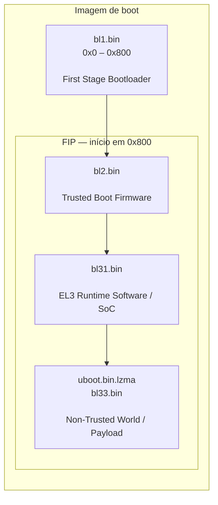

# tcboot.bin struct

## EN7523/AN7523

To update tcboot.bin, tcboot must be installed in flash memory, otherwise, it will not be possible to update the bootloader

## EN7581/AN7581

You don't need FIP Image for recovery

# Image upgrade

There are several methods to upgrade image.
  - 1. If there is no tcboot.bin in flash, you can use flash writer to program 
image.
- To program tclinux_allinone to flash address 0.
- To program tcboot.bin to flash address 0.
- To program tclinux.bin to flash address 0xc0000.
  - 2. If there is no tcboot.bin in flash, you can do image upgrade.
- Keep pressing reset button (GPIO 0) and power on. After that, the console 
will show “done”.
- Type ‘x’ to start image upgrade and select 1K-Xmodem to upload 
bootext.ram.
- After the upload is finished, the console will show “done” again.
- Type ‘x’ to start FW upgrade, and select 1K-Xmodem to upload the 
tcboot.bin.
- After upload is finished, the console will show “System Reboot...”.
 - 3. If there is tcboot.bin in flash, image upgrade can be done with tftp.
- Power on ONU and enter bootloader on consle. On PC which is 
connected to the LAN port, type “tftp -i 192.168.1.1 put "tcboot.bin"” to 
upgrade tcboot.bin. After tftp succeeds, ONU will program tcboot.bin to flash 
address 0 automatically.
- -Power on ONU and enter bootloader on consle. On LAN PC, use “tftp -i 
192.168.1.1 put "tclinux.bin"” to upgrade tclinux.bin. After tftp succeeds, ONU 
will program tclinux.bin to flash address 0x80000(EN7580) or 0xc0000
(EN7523) automatically.
- Power on ONU and enter bootloader on consle. On LAN PC type “tftp -i 
192.168.1.1 put "tclinux_allinone"” to upgrade tclinux_allinone. After tftp 
succeeds, it is necessary to run following command to program tclinux_allinone 
to flash manually.
   1. EN7580: flash <to flash addr> <from DRAM addr> <hex length>
ex: flash 0 80020000 750472
   1. EN7523: flash write <to flash addr> <hex length>
ex: flash write 0 169e003